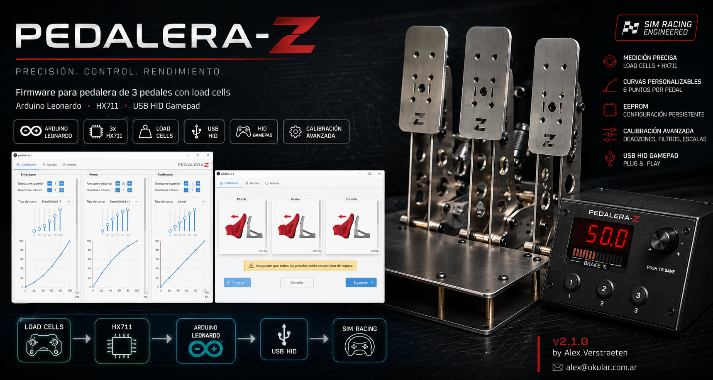

# Pedalera-Z

Firmware for a **3-pedal sim-racing controller** built around load cells and an Arduino Leonardo. Pedalera-Z reads throttle, brake, and clutch via HX711 amplifiers, exposes them as a USB HID gamepad, and supports per-pedal calibration with EEPROM persistence.

**Current version:** `v2.1.0`  
**Author:** Alex Verstraeten — [averstraeten@gmail.com](mailto:averstraeten@gmail.com)

---

## Features

- **3 load-cell pedals** mapped to HID axes: throttle (X), brake (Y), clutch (Z)
- **USB gamepad** with 3 additional buttons (shifter / auxiliary inputs)
- **Per-pedal calibration**
  - Scale, tare offset, signal filter
  - Min/max travel limits (grams)
  - Top and bottom dead zones (percentage of range)
  - 6-point response curves (0%, 20%, 40%, 60%, 80%, 100%)
- **EEPROM storage** with CRC validation; settings survive power cycles
- **Serial configuration protocol** at 115200 baud for a companion UI or scripting
- **On-device controls**
  - TM1637 4-digit display (brake max travel or bar graph)
  - Rotary encoder to adjust brake maximum force
  - Encoder push to save calibration
- **Factory reset** by holding the encoder button for ~3 seconds during boot
- **Pre-built firmware** (`.hex`) included for quick flashing without compiling

---

## Hardware

| Component | Role |
|-----------|------|
| Arduino Leonardo | MCU + native USB HID |
| 3× HX711 | Load-cell amplifier (one per pedal) |
| 3× Load cells | Throttle, brake, clutch force sensing |
| TM1637 4-digit display | Status / brake max indicator |
| Rotary encoder + push button | Adjust and save brake max |
| 3× Push buttons | HID gamepad buttons 0–2 |

### Pin mapping

| Function | Pin |
|----------|-----|
| Throttle HX711 (DT / CLK) | `6` / `7` |
| Brake HX711 (DT / CLK) | `8` / `9` |
| Clutch HX711 (DT / CLK) | `A10` / `16` |
| Display (CLK / DIO) | `3` / `2` |
| Encoder A / B / SW | `0` / `1` / `4` |
| Button 1 / 2 / 3 | `A3` / `A1` / `A2` |

Pedal identifiers in the serial protocol:

| Pedal | Axis | ID |
|-------|------|----|
| Throttle | X | `x` |
| Brake | Y | `y` |
| Clutch | Z | `z` |
| All pedals | — | `a` |

---

## Software requirements

- [Arduino IDE](https://www.arduino.cc/en/software) (1.8.x or 2.x)
- Board: **Arduino Leonardo**
- External libraries (install via Library Manager or manually):
  - [Joystick](https://github.com/MHeironimus/ArduinoJoystickLibrary) — HID gamepad
  - [Encoder](https://www.pjrc.com/teensy/td_libs_Encoder.html) — rotary encoder
  - [SevenSegmentTM1637](https://github.com/avishorp/TM1637) / **SevenSegmentFun** — display driver

The HX711 driver is vendored in this repository (`HX711.h`, `HX711.cpp`).

---

## Getting started

### Option A — Flash pre-built firmware

Pre-compiled binaries are included in the repo:

| File | Description |
|------|-------------|
| `PedaleraZ.ino.leonardo.hex` | Application firmware |
| `PedaleraZ.ino.with_bootloader.leonardo.hex` | Firmware + bootloader |
| `pzv210.hex` | Alternate build (v2.1.0) |

Flash with [AVRDUDE](https://www.nongnu.org/avrdude/), [XLoader](http://xloader.russemotto.com/), or the Arduino IDE (**Sketch → Upload Using Programmer**).

### Option B — Build from source

1. Clone this repository into your Arduino sketch folder (or open it directly in the IDE).
2. Install the libraries listed above.
3. Select **Tools → Board → Arduino Leonardo**.
4. Connect the board and upload `PedaleraZ.ino`.

On first boot, calibration defaults are written to EEPROM unless you release the encoder button within the factory-reset window (see below).

---

## Usage

### HID output

After flashing, the Leonardo enumerates as a USB gamepad:

- **X axis** — throttle (0–65535)
- **Y axis** — brake (0–65535)
- **Z axis** — clutch (0–65535)
- **Buttons 0–2** — front-panel buttons
- **Button 3** — encoder push (also triggers save on release path via `on_knob_push`)

Map axes in your sim (iRacing, Assetto Corsa, rFactor, etc.) like any USB pedal set.

### On-device adjustment

- **Rotate encoder** — change brake maximum force (display shows value in kg × 1000 g, range 1–100).
- **Press encoder** — save current calibration to EEPROM.
- **Display modes** — digits show brake max; bar mode shows live brake percentage (toggled via encoder logic).

### Factory reset

Hold the **encoder button** for ~3 seconds while the device boots. Default calibration is written to EEPROM and a snake animation plays on the display.

---

## Serial protocol

Open a serial monitor at **115200 baud**, **newline** line ending.

Commands are single-line strings. Most follow the pattern:

```
<command><pedal><value>
```

| Cmd | Name | Set example | Query example |
|-----|------|-------------|---------------|
| `e` | Enable/disable pedal | `ex1` enable throttle | `ex` |
| `s` | Scale (grams per HX711 unit) | `sy43.62` | `sy` |
| `f` | Filter (0 = heavy, 1 = light) | `fx0.5` | `fx` |
| `t` | Tare offset | `txn` tare now | `tx` |
| `t` | Tare offset (manual) | `tx134133` | — |
| `<` | Min travel (grams, forced to 0) | `<y0` | `<y` |
| `>` | Max travel (grams) | `>y40000` | `>y` |
| `u` | Dead zone top (%) | `ux5` | `ux` |
| `d` | Dead zone bottom (%) | `dy10` | `dy` |
| `c` | Response curve | `cx 0 20 40 60 80 100` | `cx` |
| `!` | Save calibration to EEPROM | `!` | — |
| `?` | Load calibration from EEPROM | `?` | — |
| `o` | Stream raw pedal values | `o1` enable | `o` |
| `v` | Firmware version | — | `v` |

**Tare now:** append `n` after the pedal id — e.g. `txn` tares throttle, `tan` tares all enabled pedals.

**Live output** (when enabled with `o1`):

```
<throttle_grams brake_grams clutch_grams>
```

Example session:

```
v
Pedalera-Z v2.1.0 by Alex Verstraeten (alex@okular.com.ar)

txn
tare x 134133

>y40000
max y 40000

!
calibration saved
```

---

## Project structure

```
PedaleraZ/
├── PedaleraZ.ino          # Main firmware
├── HX711.h / HX711.cpp    # Load-cell amplifier driver
├── *.hex                  # Pre-built firmware images
└── README.md
```

---

## Signal processing pipeline

Each pedal reading goes through:

1. **HX711 read** — raw ADC value minus tare offset, divided by scale → grams
2. **Low-pass filter** — exponential smoothing (`filter` 0–1)
3. **Dead zone** — clamp to adjusted min/max range
4. **Linear map** — grams → 16-bit HID value (0–65535)
5. **Curve remap** — piecewise linear mapping across 5 segments (0–100%)

Load-cell read failures are tolerated up to 100 consecutive errors before the pedal is reported as failed on serial.

---

## Troubleshooting

| Symptom | Check |
|---------|-------|
| Pedal not detected in Windows/game | Confirm Leonardo board and Joystick library; try a different USB port |
| Erratic readings | Re-tare (`txn` / `tyn` / `tzn`), verify HX711 wiring and load-cell excitation |
| Calibration not saved | Send `!` or press encoder; watch for `calibration saved` on serial |
| `calibration load error` on boot | EEPROM CRC mismatch — factory reset or re-save defaults |
| `invalid device` on serial | Device serial validation failed (hardware-specific EEPROM check) |

---

## Contributing

Issues and pull requests are welcome on [GitHub](https://github.com/alex-bluetrain/pedalera-z).

---

## License

No license file is included in this repository. Contact the author for usage terms.
